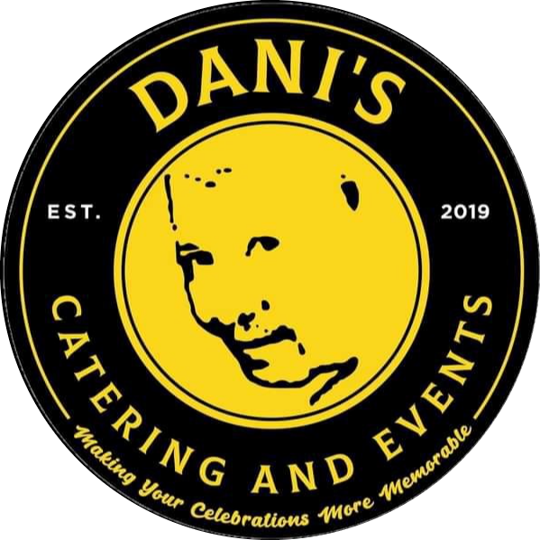

#   Dani's Catering and Events:Web-Based Wedding Supplier System
## Dani's Catering and Events -Service Module

## Introduction

A wedding is one of the important event/occasions that are traditionally celebrated by both families, relatives, friends and otherimportant people for the couple. And in preparations for the wedding the couple usually looking for suppliers that can meet the couples desire and needs for the event. With the help of this system, the user/customer can easily access and browse all the packages and services available for the customer and choose what the customer wants. 

The Dani's Catering and Events manage a lot of events but mainly focus on the wedding. In this project, the proponents proposed a web-based wedding supplier system that allows the company to manage their transaction smoothly and for the customer to easily acquire the services and packages the company offers. On the otherhand, the proponents focus on the service module as it seem to be the core of the system. In the service module there's a lot of functionalities that the user/customer can use to have transaction to the company. 

In the service module there will be a lists of packages for wedding that a customer can acquire and inquire, also there will be a lists of packages for other events like birthday's as the company not only focus on the wedding. In addition, the company allow's customization of the packages and service depending on the customers need and desire for the events. And there will be a downpayment transaction available on the service module to monitor and manage the reservations of the packages that the customer chosen on the specific date they need it. 
 

 It allows the customer to access the system by logging in the account. And for the availing of the services being offered by the company, It will show the customer how many packages and services are available on the company. With that the customer can choose a specific package where the customer can view all the details of the package. After viewing, the customer can choose and decide what to avail there will be reservation form to be filled up and receipt of the packages or service choosen. With that the customer can pay a down payment to have a propper reservation. 
 

## SDG
 The SDG's that the project is aims to attain the Decent Work and Economic Growth and the SDG will further explain:
 ### Goal 8: Decent Work and Economic Growth
    
 https://sdg.neda.gov.ph/goal-8/  

 ## Purpose and Description 
 
Customers can access and have knowledge on the packages and services that the company can offer via system without having a hassle in going to the physical office of the company. It also can save time, as both company and customer has a seamless connection on transacting with each other. If the staff and customer don't have same availability of time.  

There's a lot of considerations that the couples/client need to consider in choosing a wedding supplier. The location of the couples to the wedding supplier is another factor that can affect the cost and services that the couples can avail. The availability of the certain services and packages that's being offered on the couples/clients desired date and time.  
The study will pursue creating a system that could help both the couple and the wedding supplier.  It has features that the couples can explores at the same and can be help them in planning the wedding. The study will begin with an overview of wedding and about the wedding planners.

 
a guide for their future research on the project.

